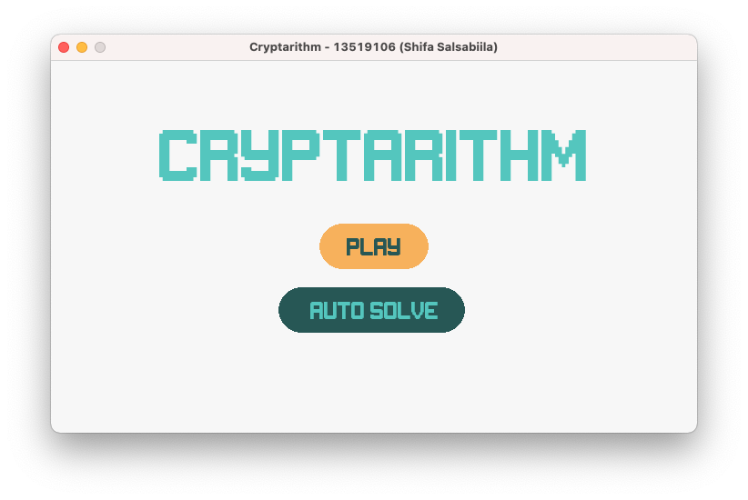
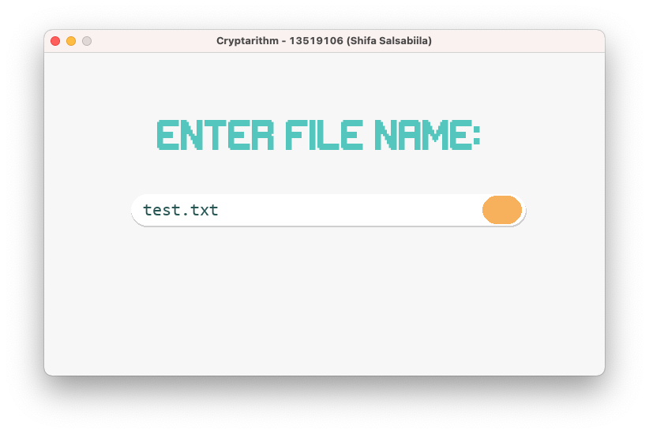
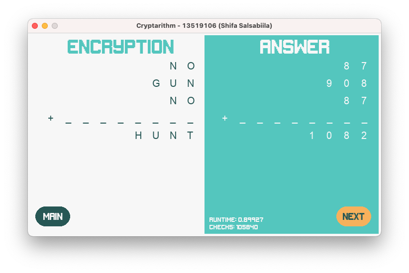

# Cryptarithm using Brute Force
This program is made to fulfill *IF2211 Strategi Algoritma* class assignment

## Technologies
* Python - version 3.8
* Pygame - version 2.0.1

## Setup
```
  $pip3 install pygame
```
Or for OS specific installation:
Windows
```
  $py -m pip install -U pygame --user
```
MacOS
```
  $python3 -m pip install -U pygame --user
```

## Installation
If you don't have the repository yet, clone the repository
```
  $git clone https://github.com/salsabiilashifa11/Cryptarithm 
```

## Executing the Program
1. On the command line, navigate to the program directory, then to the bin folder.
2. Run 'cryptarithm.py'
3. Select the 'Auto Solve' button
> At this moment, the 'Play' option is not yet ready


4. Insert the name of the file to be run, then hit the blue button
> Test files must be saved in the 'test' folder


5. Wait for the solutions to appear (It may take a while)


6. If the puzzle entered has more than one solution, click Next to navigate through other solutions.

